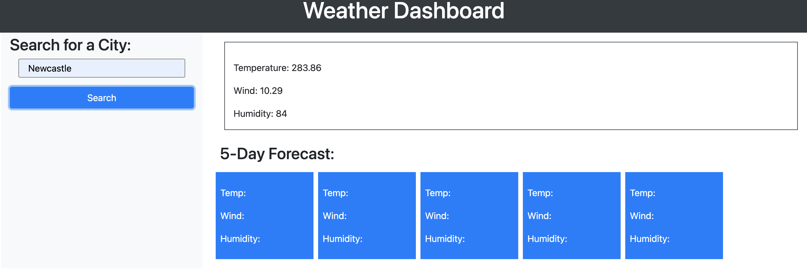

# Module 8 Server-Side APIs: Weather Dashboard
 
## User Story

```text
AS A traveler
I WANT to see the weather outlook for multiple cities
SO THAT I can plan a trip accordingly
```

## Description 

My motivation for this project was to create server-side API using **OpenWeatherMap** to display the current weather and the weather forecast for the next 5 days.

## Final Result

When the user enters the city and clicks on the search button it displays the current weather for that day.



## GitHub

[GitHub](https://github.com/bex-ford/module-8)